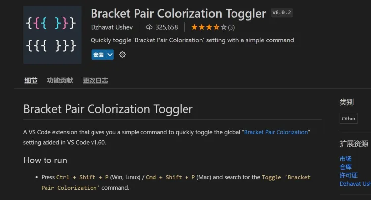

当你处理嵌套和逻辑条件时，情况会变得很糟。大括号对着色器通过给每个大括号对附加不同的颜色，解决了代码中大括号对猎取的问题。

***强烈推荐安装使用，因为实在是太好用了。***

对于制作出这个扩展的理由，作者是这这么讲的：“这是一个有趣的小项目，每个人都会有需要它的那些时候的。”
> A fun little project. Everyone needs one of those once in a while 🙃

这意味着，如果你有多个大括号，为了我们的方便和代码效率，它很容易被配上颜色。

它的[官方介绍界面](https://marketplace.visualstudio.com/items?itemName=dzhavat.bracket-pair-toggler)。
