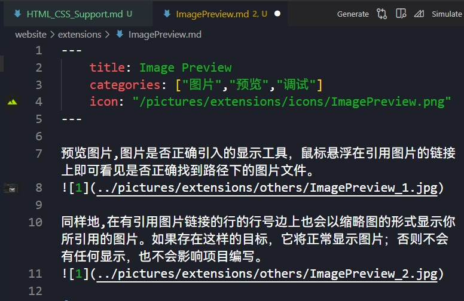

预览图片,图片是否正确引入的显示工具，鼠标悬浮在引用图片的链接上即可看见是否正确找到路径下的图片文件。  

同样地,在有引用图片链接的行的行号边上也会以缩略图的形式显示你所引用的图片。如果存在这样的目标，它将正常显示图片；否则不会有任何显示，也不会影响项目编写。  

这个扩展在你检查你的图片引用代码时非常管用。

更多介绍详见它的[官方介绍界面](https://marketplace.visualstudio.com/items?itemName=kisstkondoros.vscode-gutter-preview)。
