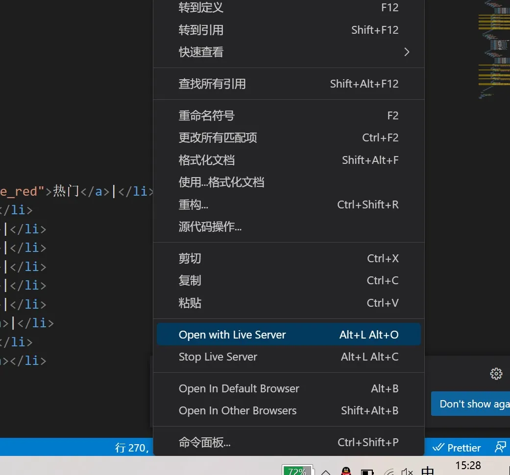

启动具有静态和动态页面的实时重新加载功能的开发本地服务器，前端开发利好。

扩展安装完成后打开一个html文档，右键单击空白处即可找到 ``Open with Live Server`` ，或在窗口右下角点击  启动。  

将VS Code与浏览器像下图这样并排，便可实时显示HTML内容。当VS Code保存 ( `Ctrl+S` ) 一次右侧页面便会更新——**没错，它是实时、热更新的。**

它的更多介绍详见它的[官方介绍页面](https://marketplace.visualstudio.com/items?itemName=ritwickdey.LiveServer)。
