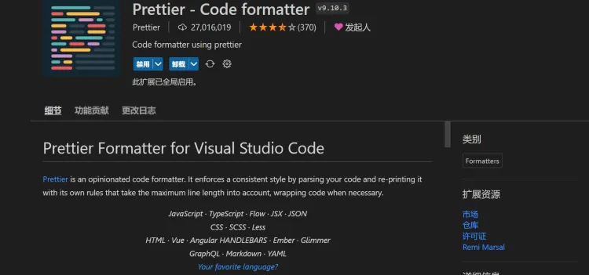

Prettier 是最受欢迎的格式化和 linting 工具，可根据行业惯例标准化您的代码。它还确保您的团队在外观上创建视觉上无缝的代码 - 因此无需再争论您应该使用多少个制表符或空格或括号应该放在哪里。



可以配置.prettierc.js文件,配合eslint、git hooks 一起使用，提升项目代码的规范性

```js
module.exports = {
    printWidth: 100,// 一行最多 100 字符
    useTabs: false,// 不使用缩进符，而使用空格
    tabWidth: 4,// 使用 4 个空格缩进
    tabSize: 4,
    semi: true,// 行尾需要有分号
    singleQuote: true,// 使用单引号
    quoteProps: 'as-needed',// 对象的 key 仅在必要时用引号
    jsxSingleQuote: false,// jsx 不使用单引号，而使用双引号
    trailingComma: 'es5',// 末尾不需要逗号 'es5'  none
    bracketSpacing: true,// 大括号内的首尾需要空格
    jsxBracketSameLine: false,// jsx 标签的反尖括号需要换行
    arrowParens: 'always',// 箭头函数，只有一个参数的时候，也需要括号
    rangeStart: 0,// 每个文件格式化的范围是文件的全部内容
    rangeEnd: Infinity,//不设置格式化的结束行，即对应文件内的所有内容
    requirePragma: false,// 不需要写文件开头的 @prettier
    insertPragma: false,// 不需要自动在文件开头插入 @prettier
    proseWrap: 'preserve',// 使用默认的折行标准
    htmlWhitespaceSensitivity: 'css',// 根据显示样式决定 html 要不要折行
    endOfLine: 'lf',// 换行符使用 lf 结尾是 \n \r \n\r auto
}; 
```

更多介绍，详见它的[官方介绍界面](https://marketplace.visualstudio.com/items?itemName=esbenp.prettier-vscode)。
