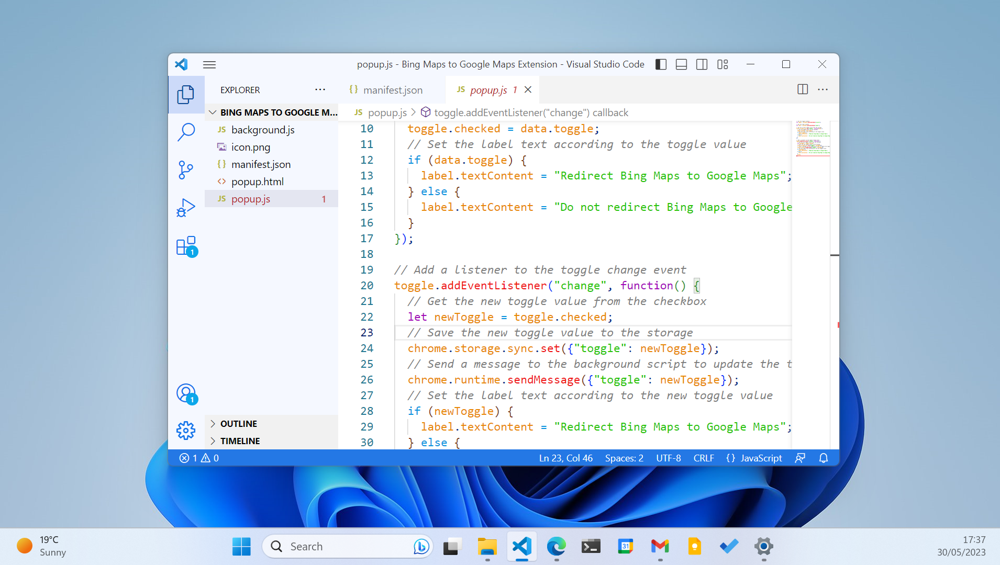
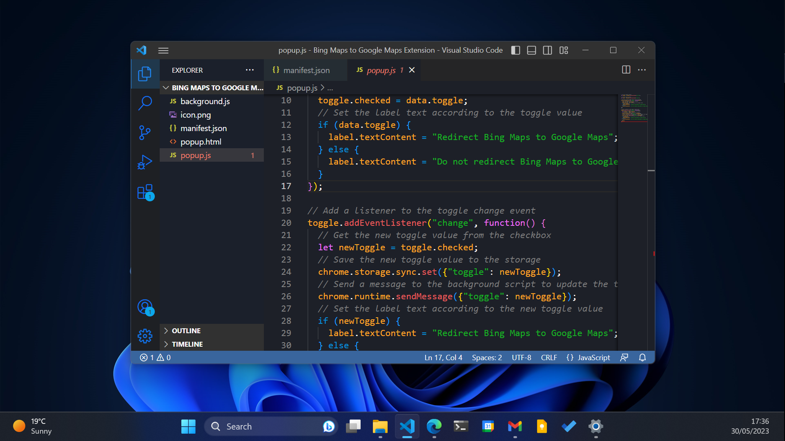

本扩展通过更改了VS Code的GUI，使之与Windows 10和Windows 11（尤其是后者）相适应，从而显示得不突兀。

同时，本扩展会根据不同的语言，对不同的关键字和语法进行分别上色。

亮色主题：

暗色主题：

它的[官方介绍页面](https://marketplace.visualstudio.com/items?itemName=ExtensionCreator.windows-11-color-theme)。
