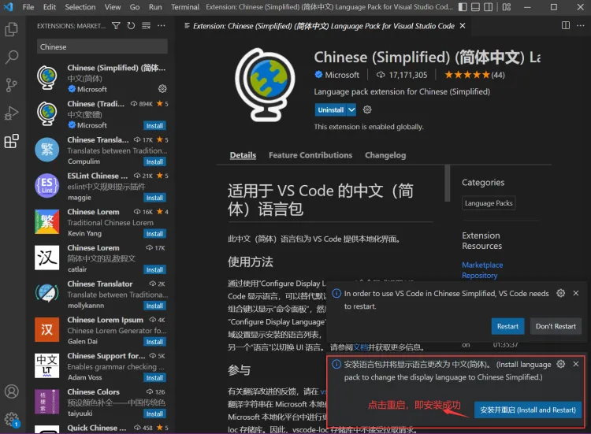
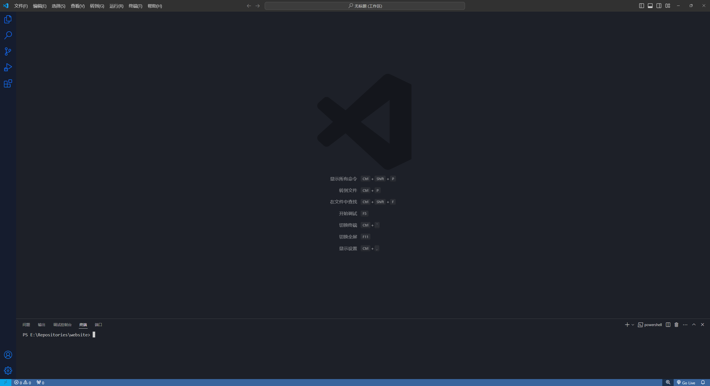

本文是给很不习惯全英文开发环境的同志准备的。如果你习惯全英文开发的话，请忽略本文。

打开vscode，在左侧的  (扩展，或快捷键``Ctrl+Shift+X``)搜Chinese中文包进行安装，之后重启vscode。

重启后，你能看到的界面大概类似这样：

你看到我的界面可能和你的界面长得有出入，这是因为我安装了***Windows 11 Color Theme***扩展导致的。该扩展可以在本网站找到介绍。

接下来，就可以开始让Code发挥它的价值了！
