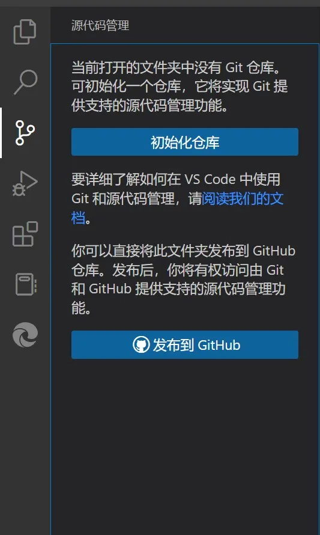
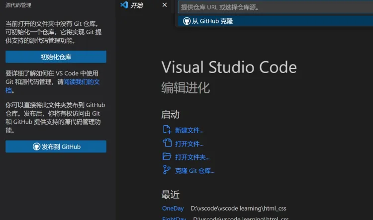

本篇文章起，将简要介绍VS Code的一项重头戏：利用Git和集成在Code内的源代码管理功能，对你的项目源码进行管理。这项功能将Code的功能抬升了一个大台阶——它不再只是一个单纯的文本编辑器，它在项目开发上能给你提供不小的便利。

在这里，我们简要向你介绍一下何为Git：

    Git是一个开源的分布式版本控制系统，主要用于软件开发中的源代码管理。它由Linus Torvalds创建，也是Linux内核开发所使用的工具。与其他版本控制系统不同，Git采用了分布式版本库的方式，这意味着每个开发者的计算机上都有完整的代码库副本，这样就可以在没有服务器的情况下进行版本控制，使得源代码的发布和交流变得非常方便。  

Git的主要特点包括：

- 数据完整性：Git使用SHA-1算法保护代码的完整性，确保代码内容在传输和存储过程中不会受损。  
- 速度和效率：Git在处理大型项目时非常快速高效。  
- 支持非线性开发：Git支持快速和简便的分支管理和合并，这对于多人协作的项目来说非常有用。  
- 轻松备份：分布式结构意味着每个开发者的工作都是对代码库的一个备份，这增加了数据的安全性。  

Git的基本工作流程包括：

- 修改：在本地代码库中进行更改。  
- 暂存：选择特定更改加入下一次提交。  
- 提交：将暂存的更改保存到本地代码库。  
- 推送：将本地的更改推送到远程代码库。  

Git也常与GitHub一起使用，GitHub是一个提供Git仓库托管服务的平台，它让开发者能够共享代码并进行协作开发。

VSCode的左侧边栏提供了源代码管理这个选项，使用它能很好的帮助我们使用git进行管理。



## 准备工具

- 安装好VS Code。
- 安装git并添加到环境变量。

关于如何安装Git，本文不做介绍。详情参照这个链接：[Git安装教程](https://blog.csdn.net/qq_43715354/article/details/108638061%20)

### Git安装

安装完git之后重启VSCode，源代码管理栏就会变成如下情况


配置账号和密码，全局模式下。这一步需要你使用Git Bash完成，或者找到相应的配置文件进行修改。教程请自行Baidu/Bing/Google.

```js
git config --global user.email "you@example.com"
git config --global user.name "Your Name"
```


