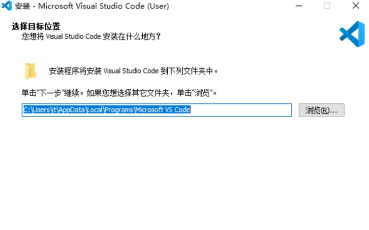
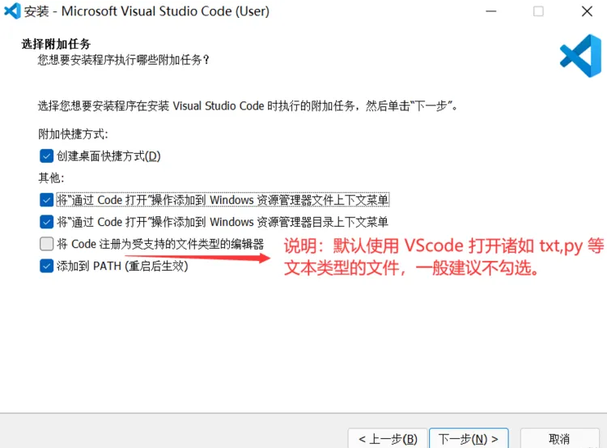
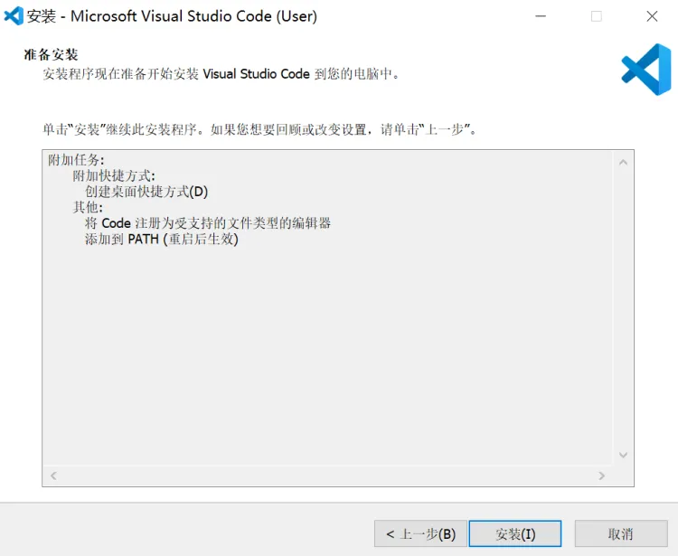

本文起简要讲述各位利用VS Code开发前的前置工作。

## 1. 下载安装文件的渠道

官方网址：https://code.visualstudio.com/download#

## 2. 根据自己的操作系统来选择对应的VSCode版本。

- ⬆这是以前Code官网多系统的下载界面

- 这是当下(图截于2023.12)最新的安装界面，因为后续在x86平台和Arm平台上的Windows（从11开始）仅提供了64位系统，所以开发者也只提供了x64和Arm64的安装包。

在Windows系统下，一般选择x64的安装包就行(除非你用的是32位系统，但现在理论上已经不存在了。)

在管理员账户下，应该是只能用System Installer安装的（用User Installer安装会出现错误不让安装）。
需要注意的是，如果你后来对你的电脑进行了一些**大动根基**的操作，如：

> 在Windows环境下，因为***原来本地账户名是中文***导致各种开发工作受阻而**重装系统**并由此建立了个英文名的本地***管理员账户***，并一直使用该***管理员账户***活动。

这在我们本科学习期间也往往是难以回避的事情，而它不止会发生于你们在进行某一项项目的开发进程中。在很多本科期间要学习的课程中，但凡涉及到了***非国产的开发软件***，中文用户名和中文路径基本都是我们需要一次次地、反复地确认的问题。

如果你真的是像上面这样的，那么请你注意你下载的安装包类型。

## 3. 安装

1.**在下载文件夹中打开刚下好的安装包**

2.**勾选“我同意此协议”，点击“下一步"**

- 此示例是用的User Installer包，使用System Installer包同理。

3.**选择安装位置，可根据自己习惯更改。建议将安装路径放在系统盘之外，点击“下一步”**

4.**这里可以根据自己需求勾选（也就是说没有必勾选项），值得注意的是，如果你勾选了“添加到PATH（重启后生效）”，那么重启之后系统会帮你自动配置好环境变量，当然你也可以选择自己配置**

5.**点击“安装”，等待安装进度条拉满，点击“完成”**

6.**至此，你已经完成了VS Code的安装。**
