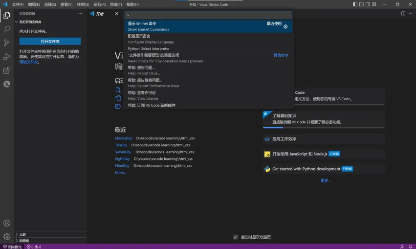

## VSCode的学习网址

Mac OS官方教程：https://code.visualstudio.com/docs/setup/mac

（个人向）推荐的使用教程：https://geek-docs.com/vscode/vscode-tutorials/what-is-vscode.html

如何简单的找到官方教程？

## 简单配置

**更改颜色主题**  
点击左下角管理，点击颜色主题

根据自己的需求进行修改

**更改字体设置**  
点击管理中的设置选项

“Font Size”控制字体大小，“Font Family”控制字体系列，这里根据个人喜好设置

**自动保存**  
点击管理中的设置

**搜索自动保存**  
将设置里的“Auto Save”配置修改为``afterDelay``，并设置时间，这里我设置的是1000毫秒

## 工作台介绍

**面板栏**
命令面板是VSCode快捷键的主要交互界面，你可以通过``F1``或者``Ctrl+Shift+P``打开。你可以在命令面板中快速搜索命令并且执行。如果你的 VSCode 是简体中文版，那么你可以在命令面板里使用中文或者英文来搜索命令。VSCode 的绝大多数命令都可以在命令面板里搜到，所以熟练使用命令面板，你就可以摆脱鼠标，完全通过键盘操作来完成全部编码工作。

**活动栏**
最左侧的一列，包括资源管理器、查找、源代码管理、debug调式（一般用于后端的调理）、插件安装

**状态栏**  
显示代码状态和调试状态；是否处于调试状态，代码是否在编辑状态等

**编辑栏**
编写代码的区域

**侧边栏**
新建项目文件和文件夹，一般用于整体浏览项目布局

## 打开项目文件
点击左上角文件，打开文件夹

选择你需要打开的项目目录即可

当然你也可以选择新建文件或者文件夹

之后你就可以对项目文件进行编辑了~

## 快速编写代码小技巧

以HTML为例：

1. ! ``Enter``，快速生成HTML基本骨架
2. ``div``*``2`` ``Enter`` 生成两个并列的div
3. ``div.c1`` ``Enter``
4. ``div#d1`` ``Enter``
5. ``div{$}``*``数字`` 多个平级标签的排序
6. ">"表示包含关系——ul >li*4 快速生成包含4个li的列表
