## 基本流程

前面的文章提到过，Git的基本工作流程包括：

- 修改：在本地代码库中进行更改。  
- 暂存：选择特定更改加入下一次提交。  
- 提交：将暂存的更改保存到本地代码库。  
- 推送：将本地的更改推送到远程代码库。  

### 创建仓库
进入github官网，注册，登录，在右上角添加一个仓库(repository)

下面是一个 repository 最基本的信息，我们需要清楚了解每一个都是什么意思。配置完每个参数之后，我们就可以创建仓库。

生成仓库的基本结构
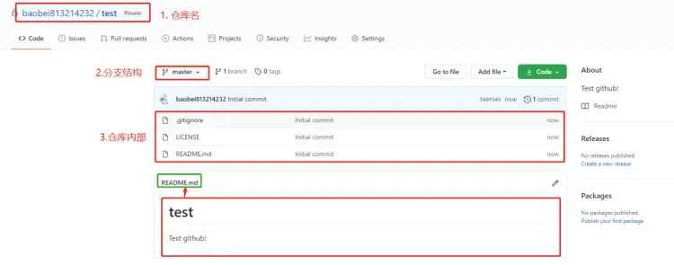

在本地创建一个文件夹，用来接受test这个仓库内部的文件，也就是clone操作

### VSCode绑定GitHub

点击“发布到GitHub”，然后会跳转到网页处，输入账号密码登录GitHub
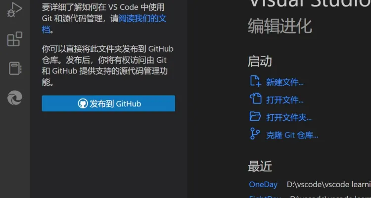

点击 Continue ，这样我们的VSCode就会和GitHub关联起来了，然后点击打开

这时候会跳回 VSCode，询问是否关联起来，点击 Open
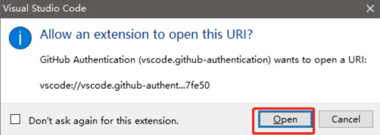

关联成功之后就可以看到账户里连接到了GitHub
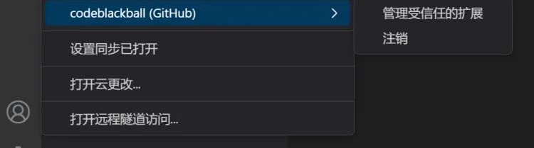

### 基础知识

clone意思就是把GitHub上的仓库文件，克隆到本地，方便我们进行代码的修改或迭代

点击“初始化仓库”，这时候就会切换界面到达监视区

显示“源代码管理”的bar右侧有五个选项，分别为：**查看形式**：可以选择文件排列形式
**提交**：用来提交版本信息到达本地仓库
**刷新**：刷新当前文件修改的内容
**创建拉取请求**：用于创建一个拉取请求。
拉取请求是使你更改过后的代码经历审核、被整合到目的分支的必要操作。大致过程为：创建新分支（作为新代码整合的源分支）->更改代码并存入该分支->创建拉取请求->审核代码->整合新代码到目的分支中。
拉取请求的产生，说明了你对代码做出的更改和对代码建设工程做出的贡献，它会将你更改的部分和原来的部分进行对比并进行展示。

**更多操作...**的界面如下
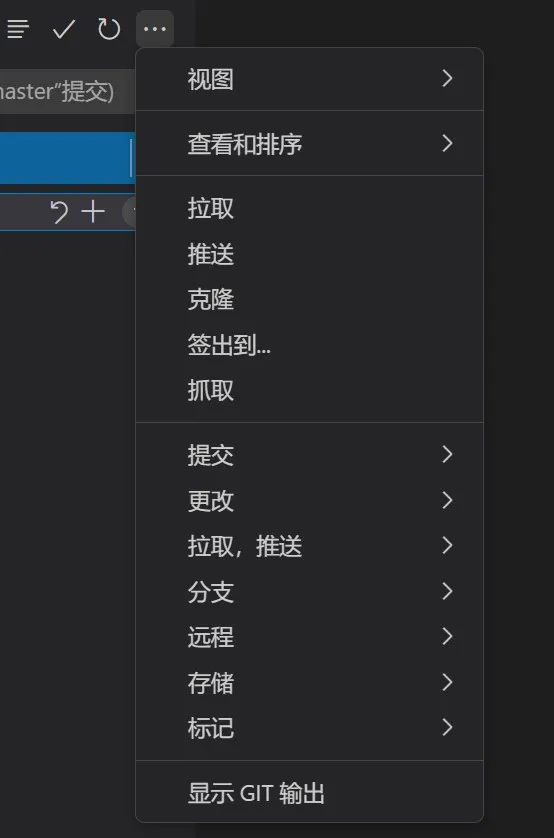
拉取：从仓库获得文件
推送：文件上传至仓库
克隆：仓库整体克隆到本地中

左下角部分显示内容（从左至右）：

**分支结构**：名为master的分支结构
**云端信息**：上传与下载的次数
**问题**：错误和警告
如有其他图标，可能是你的Code安装了其他拓展，或Code经历了某次更新，新添加了一些元素所致。

### 代码上传

**Clone**

整体仓库克隆到本地当中
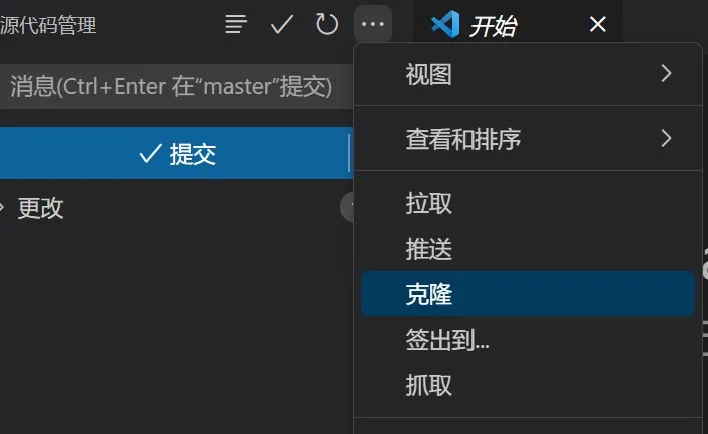
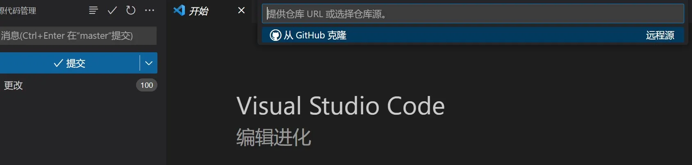

权限问题，点击允许，将会跳到一个GitHub授权画面，同理VSCode默认也要授权
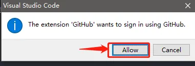

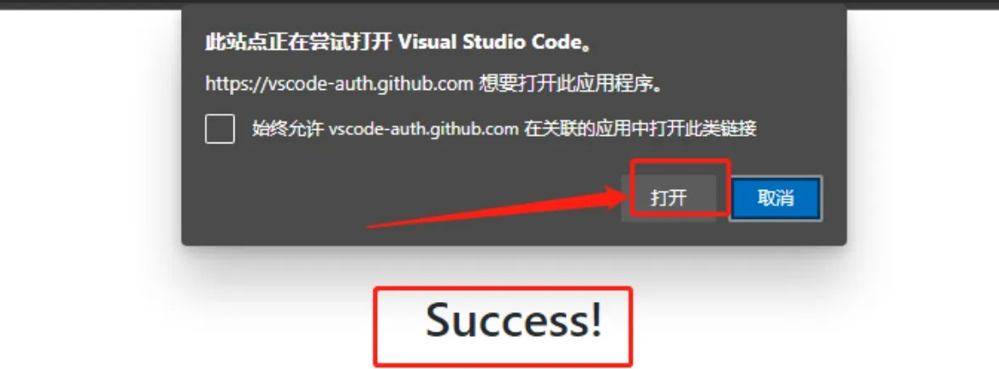
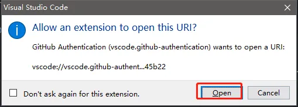

由于我建立的仓库是私有的，所以最好手动输全，由GitHub 用户名/工程名
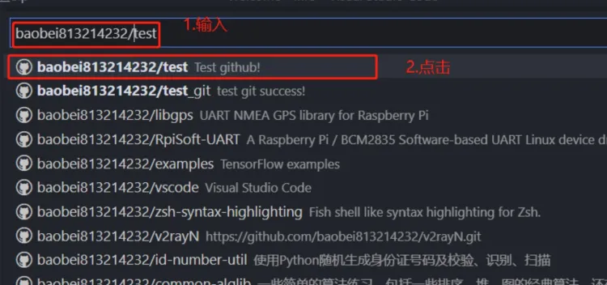

询问是否打开仓库，点击 Open，将会重启 VSCode进入克隆好的仓库内部
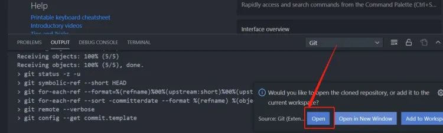

**Commit**
clone 成功之后，我们就可以在上面进行代码的修改等操作了，操作完之后，想要再保存版本，我们就需要分为两步，第一步，把代码信息上传到本地库当中，有两个隐藏文件是会保存版本信息的。第二步，保存的是本地的信息，我们还需要把本地库上传到 GitHub上面

新建两个文件，里面无内容，然后 commit(提交)

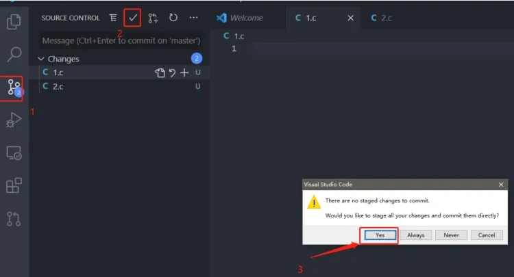

增加版本信息，写越全越好，方便后期主机回头查看，之前显示已修改的文件此时同步到本地仓库了。

**push**
接下来准备把本地仓库内容，Push 到GitHub上面，最终我们可以在 GitHub 网站看到自己的库，如果你只是做个人的开发，可以选择不 Push，直接在把库保存在本地
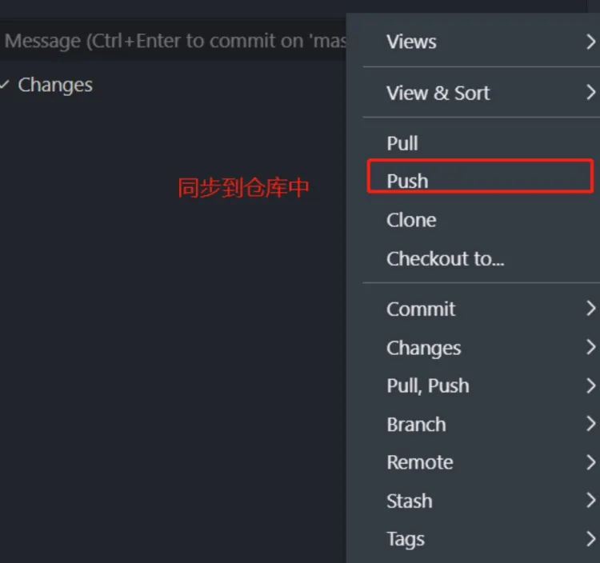

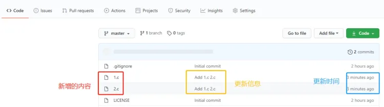
